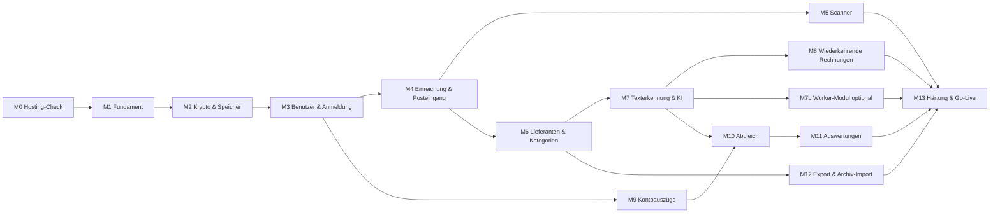

# Roadmap – Meilensteine und Issues

Jeder Meilenstein endet mit einem **Pre-Release**, das auf der Testinstanz
(Update-Kanal beta) läuft. Issues sind so geschnitten, dass sie in **einer**
Claude-Code-Session umsetzbar sind. Das Format unten wird in Session 1 per
`gh` in GitHub-Milestones und -Issues übertragen (siehe `VORGEHEN.md`).

Format je Issue: `ID · Titel` – Spec-Verweis – Abnahme.

---

## M0 – Hosting-Check *(vor allem anderen, ~1 Session)*

Ziel: Annahmen der Specs auf dem echten Webspace verifizieren, bevor
Architektur darauf baut.

- **M0-1 · `tools/hosting-check.php` schreiben** – 06 §5 – Skript läuft
  lokal im Docker und auf dem Webspace, Ausgabe als Tabelle + JSON, per
  Token geschützt, keine Abhängigkeiten.
- **M0-2 · Befunde dokumentieren** *(manuell durch Mirko + Claude)* –
  Ergebnis in `docs/hosting-befunde.md`, Folge-Issues für jede
  Abweichung (z. B. Argon2 fehlt, Request-Limit 60 s, Upload-Limit).

## M1 – Fundament (Übernahme aus dem Vereinskalender)

Ziel: leere, aber installier- und updatebare Anwendung.

- **M1-1 · Projektgerüst übernehmen** – CLAUDE.md §7 – composer.json,
  Docker, phpunit.xml, CI, Release-Workflow, Http/Config/Database/
  Migration/Logger aus dem Vereinskalender portiert, Namespace/Name
  angepasst; `docker compose up` zeigt Startseite; CI grün.
- **M1-2 · Installer, setup.php, Updater, Wartungsmodus übernehmen** –
  06 §1 – setup.php-Flow im frischen Container; Update von v0.1.0 auf
  v0.1.1 auf der Testinstanz funktioniert; Shim-/CSP-Tests übernommen.
- **M1-3 · Layout & Designsystem** – E-07 – Basislayout für
  öffentliche Seiten, Anwenderseite, Adminseite; htmx eingebunden (CSP-
  konform); mobile-first; Hell/Dunkel; Formular-Komponenten; Flash-
  Meldungen.
- **M1-4 · Backup/Restore übernehmen (ohne Blobs)** – 06 §2 – Roundtrip-
  Test grün.
- **M1-5 · Cron-Endpunkt + Job-Tabelle (Gerüst)** – 06 §4 – Cron-URL mit
  Token, Aufräum-Task-Schnittstelle, `job`-Tabelle, Test für Sperre
  `locked_until`.

**Release v0.1.0** – installierbar auf all-inkl-Test-Subdomain.

## M2 – Krypto-Kern & Speicher

- **M2-1 · Crypto-Service** – 01 §2 – Server-Schlüssel (secretbox),
  Sealed-DEK, Feld-AEAD mit AAD, Blind Index; alle Pflicht-Tests aus 01.
- **M2-2 · Tresor-Schlüsselpaar & Wrapping** – 01 §2 – Tresor erzeugen,
  Benutzerschlüssel wrap/unwrap (Argon2id), Grant versiegeln/öffnen,
  Wiederherstellungsschlüssel (Base32 + Prüfsumme) – rein als Service mit
  Tests, noch ohne UI.
- **M2-3 · Blob-Storage** – 02 Dateien, CLAUDE.md §5 – secretstream-
  Verschlüsselung, Backends `db` und `fs`, Streaming-Lesen (Download/
  Anzeige ohne Temp-Klartext), Tests je Backend.
- **M2-4 · Chunk-Upload-Komponente** – 03 §4 – Server-API + JS-Modul,
  Magic-Byte-Prüfung, Aufräumen im Cron.
- **M2-5 · Speicher-Backend umstellen** – Schrittkette db→fs und fs→db,
  Admin-Seite, Integritätsprüfung danach.
- **M2-6 · Backup mit Blobs** – 06 §2.

## M3 – Benutzer, Anmeldung, Rollen, Mail

- **M3-1 · Mail-Versand (SMTP + Queue)** – 06 §3 – Admin-Einstellungen,
  Testmail, Queue mit Retry im Cron.
- **M3-2 · Installer-Erweiterung: erster Admin + Tresor +
  Wiederherstellungsschlüssel** – 06 §1, 01 §2.
- **M3-3 · Login E-Mail/Passwort + Session-Entsperrung** – 01 §2–3 –
  Tresor nach Login entsperrt; ohne `__Host-vk`-Cookie kein
  Entschlüsseln; Rate-Limit; generische Fehler.
- **M3-4 · 2FA: TOTP + E-Mail-Code + Backup-Codes + Gerät merken** – 01 §3.
- **M3-5 · Passwort vergessen / ändern** – 01 §2–3 – inkl. Hinweis
  „Freigabe durch Admin nötig" nach Reset.
- **M3-6 · Rollen & Rechte** – 01 §4 – `Permission`-Enum, sechs
  mitgelieferte Rollen inkl. Kassenprüfer und Steuerberater, Rollen-CRUD,
  Route-Rechte-Deklaration + Test „jede Route hat Rechte", Kostenstellen-
  Scope, Zeitraum-Scope + Ablaufdatum externer Konten.
- **M3-7 · Benutzerverwaltung + Einladung + Tresor-Freigaben** – 01 §2 –
  Einladen, Sperren, Ablaufdatum, Banner „Freigaben ausstehend".
- **M3-8 · Audit-Log mit Hash-Kette** – 01 §6 – inkl. Admin-Ansicht +
  Integritätsprüfung.
- **M3-9 · Wiederherstellung per Wiederherstellungsschlüssel** – 01 §2.
- **M3-10 · Adminseite „Systemcheck"** – 06 §5 – zeigt zur Laufzeit, ob die
  M0-Annahmen noch gelten: effektives `zend.exception_ignore_args`,
  `wait_timeout` des Servers, Grenzwerte und Erweiterungen. Der Dienst
  dahinter steht seit M1-1, es fehlt die Seite. Schließt die Restpunkte von
  #97 und #98.

**Release v0.3.0** – Anmeldung produktionsreif; Security-Review-Checkliste
aus M13-1 vorziehen und für diesen Stand einmal durchgehen.

## M4 – Öffentliche Einreichung & Posteingang

- **M4-1 · Stammdaten Kostenstellen** – 02 – CRUD, Sortierung.
- **M4-2 · Einreichungsseite `/einreichen` (ohne Scanner)** – 03 §1 –
  Kamera/Bild/PDF, mehrere Seiten, Angaben, IBAN-Prüfung, Chunk-Upload,
  Referenznummer, Bestätigungsmail; verschlüsselt per Sealed Box.
- **M4-3 · Spamschutz ohne Hürde** – 01 §5, E-14 – Rate-Limit,
  unsichtbarer Proof-of-Work, Honeypot, Mindest-Ausfülldauer, Größen-/
  Seitenlimits, Einreichung pausierbar.
- **M4-4 · PDF aus Bildern erzeugen + Original aufbewahren** – 03 §3.
- **M4-5 · Posteingang** – 02 Statusmodell – Liste mit Filtern, Vorschau
  (Bilder/PDF gestreamt entschlüsselt), Statuswechsel, Ablehnen mit Grund,
  Wiedervorlage, Mail an Rolle Finanzen bei neuer Einreichung.
- **M4-6 · Interne Erfassung `/app/belege/neu`** – 03 §1 – Mehrfach-Upload.
- **M4-7 · Job-System + Session-Worker (Browser-Jobs)** – 06 §4, CLAUDE.md
  §6a – `executor`-Spalte von Anfang an, Fortschritt in der Kopfzeile,
  Sperren, Hintergrund-Tab-Verhalten.
- **M4-8 · PDF-Rasterung mit pdf.js** – 03 §3 – als erster Browser-Job.

**Release v0.4.0** – Verein kann produktiv Belege einreichen lassen
(manuelle Prüfung, noch ohne KI).

## M5 – Scanner (Bildaufbereitung im Browser)

- **M5-1 · Scanner-Mathematik als reine Funktionen** – 03 §2 –
  Homographie, Entzerrung, adaptive Schwelle; node-Tests.
- **M5-2 · Kantenerkennung** – 03 §2, E-03 – mit ≥ 20 echten Belegfotos als
  Fixtures (anonymisiert), Trefferquote dokumentiert.
- **M5-3 · Eck-Editor-UI** – ziehbare Ecken, Lupe, Farbmodus-Umschalter.
- **M5-4 · Einbau in Einreichung und interne Erfassung** + GD-Fallback.

## M6 – Lieferanten & Kategorien

- **M6-1 · Kategorien-Verwaltung + Seed (Ausgaben + Einnahmen)** – 02 Kategorien.
- **M6-2 · Lieferanten-CRUD** – 03 §7 – inkl. mehrerer IBANs/Aliasse,
  Blind-Index-Schlüssel (`supplier_key`).
- **M6-3 · Beleg-Prüfansicht (manuell)** – 03 §6 Prüfansicht – Felder
  manuell erfassen, Richtung (Ausgabe/Einnahme), Lieferant bzw. Zahler
  wählen/anlegen, Kategorie/Kostenstelle, „Geprüft, nächster".
- **M6-4 · Festschreibung** – 01 §7 – ohne Vier-Augen (E-09).
- **M6-5 · Lieferanten zusammenführen** – 03 §7.
- **M6-6 · Duplikaterkennung** – 02 Statusmodell.

## M7 – Texterkennung & KI

- **M7-1 · KI-Anbieter-Verwaltung + Verbindungstest** – 03 §6, E-08 –
  Profile, API-Key verschlüsselt, Vorlage **OpenAI** als Standard.
- **M7-1b · Profil-Vorlage Anthropic** – Fähigkeitserkennung beim Test.
- **M7-1c · Profil-Vorlage llama.cpp** – inkl. Doku Reverse-Proxy.
- **M7-2 · LlmClient + FakeLlmClient + Schema-Validierung + Reparatur** –
  03 §6.
- **M7-3 · Textlayer-Extraktion digitaler PDFs** – 03 §3.
- **M7-4 · E-Rechnungen (ZUGFeRD/XRechnung)** – 03 §3.
- **M7-5 · Job `ai_extract` mit Prompt `extract-v1`** – 03 §5–6 – Logik in
  `Service/Processing` (framework-frei, Architekturtest), Ergebnis als
  `document_artifact`, in der Prüfansicht vorbelegt, Konfidenz-Markierung,
  Warnungen.
- **M7-6 · Lieferanten-Auflösung automatisch** – 03 §7 – 6 Stufen,
  Auto-Anlage mit `needs_review`, Liste „Neue Lieferanten prüfen".
- **M7-7 · Kategorisierung: Regeln > Lieferanten-Default > KI** – 03 §8.
- **M7-8 · KI-Protokoll** – Aufrufe, Dauer, Tokens je Anbieter im Admin.

**Release v0.7.0** – KI-gestützte Belegerfassung (ohne Worker, über die
Session).

## M7b – Worker-Zusatzmodul (optional)

Ziel: OCR/PDF-A und KI-Auslesen rund um die Uhr auf einem Raspberry Pi 4,
per Admin zuschaltbar. Alles andere funktioniert weiterhin ohne.

- **M7b-1 · Worker-API + Kopplung + HMAC-Auth** – 07 §4–5.
- **M7b-2 · Worker-Grants, Worker-Kontext, Artefakt-Upload** – 07 §3.
- **M7b-3 · Routing + Fallback + Admin-Seite „Worker"** – 07 §6 – inkl.
  „OCR nachholen" und Alarm-Mail.
- **M7b-4 · Worker-Programm `bin/worker.php`** – 07 §2, §5 – Polling,
  `render_pages` (Poppler), `ocr` (OCRmyPDF), `ai_extract` über
  `Service/Processing`, tmpfs, sauberes Beenden.
- **M7b-5 · Docker-Image Multi-Arch + Release-Workflow** – 07 §7 –
  arm64/amd64 nach GHCR, Tags beta/stable; End-to-End-Test im CI
  (Webhoster- + Worker-Container).
- **M7b-6 · Einrichtungsanleitung Raspberry Pi** – `docs/worker-einrichtung.md`:
  Docker auf Debian, Compose-Vorlage, Kopplung, Updates, Logs,
  Ressourcen, Fehlersuche. Abnahme: echte Einrichtung auf dem Pi nach
  Anleitung.

**Release v0.8.0** – Worker-Modul auf der Testinstanz mit dem Pi.

## M8 – Wiederkehrende Rechnungen

- **M8-1 · Serienerkennung + Vorschläge** – 03 §9.
- **M8-2 · Übersicht wiederkehrende Kosten + „überfällig"** – 03 §9.

## M9 – Konten & Kontoauszüge

- **M9-1 · Konten-Verwaltung inkl. Kasse und Kassensturz** – 04 §1.
- **M9-2 · MT940-Parser** – 04 §2 – mit echten, anonymisierten Dateien von
  Sparkasse und VR Bank.
- **M9-3 · CSV-CAMT-Profile Sparkasse/VR Bank + Mapping-Assistent** – 04 §3.
- **M9-4 · Import-Ablauf mit Vorschau, Saldenprüfung, Duplikaten** – 04 §4.
- **M9-5 · Buchungsliste + manuelle Buchungen ohne Beleg (Kasse und
  Konten, v. a. Einnahmen)** – 04 §1, E-17.
- **M9-6 · Regeln „kein Beleg nötig" / Kategorie für Buchungen** – 04 §5.

## M10 – Abgleich Beleg ↔ Buchung

- **M10-1 · Allocation-Modell + abgeleitete Status** – 04 §5 Modell.
- **M10-2 · Scoring + Auto-Zuordnung + Vorschläge** – 04 §5.
- **M10-3 · Erstattungen (Einreicher-IBAN, Kombinationssuche)** – 04 §5.
- **M10-4 · Abgleich-Oberfläche** – 04 §5.
- **M10-5 · Übersichten: unbezahlt, offene Erstattungen, Buchungen ohne
  Beleg, erwartete Belege** – 04 §5.
- **M10-6 · Umbuchungen eigene Konten** – 04 §5.

**Release v0.10.0**

## M11 – Auswertungen

- **M11-1 · ReportService (reine Berechnung) + Tests** – 05 §1.
- **M11-2 · Dashboard** – 05 §1.
- **M11-3 · „Wohin fließt das Geld" mit Drilldown** – 05 §1.
- **M11-4 · Kassenprüfungs-Report + CSV-Exporte** – 05 §1.

## M12 – Export & Archiv-Import

- **M12-1 · Pfad-/Dateinamen-Muster mit Monatsordnern + Tests** – 05 §2.
- **M12-2 · Gestreamter ZIP-Export mit Filtern + index.csv** – 05 §2.
- **M12-3 · Archiv-Import (ZIP, Dateinamen-Parser, Ordner-Semantik)** –
  05 §3 – Probelauf mit einem echten Jahresarchiv.

## M13 – Härtung & Go-Live

- **M13-1 · Security-Review** – Checkliste: OWASP ASVS Level 2 (Auth,
  Session, Access Control, Upload, Krypto), CSP, Header, Rechte-Matrix-
  Test, Fehlerseiten ohne Details, Logs ohne Klartext.
- **M13-2 · Code-Integritätscheck** – 01 §8.
- **M13-3 · Datenschutzerklärung/Impressum-Seiten + Texte für
  Einreichung** – Hinweis KI-Anbieter (OpenAI/Anthropic: AV-Vertrag),
  Aufbewahrung.
- **M13-4 · Verfahrensdokumentation (Vorlage)** – Ablauf Erfassung →
  Prüfung → Festschreibung → Archivierung, als Markdown für den Verein.
- **M13-5 · Performance-Test** mit 3 000 Belegen / 5 000 Buchungen
  (Auswertungen < 3 s, Posteingang < 1 s).
- **M13-6 · Betriebsdoku** – `docs/betrieb.md`: Installation, Cron,
  SMTP/SPF/DKIM, Backups, Wiederherstellungsschlüssel, Rollen einrichten.

**Release v1.0.0**

---

## Backlog (nach 1.0, nicht einplanen)

Steuerliche Sphären einschalten und auswerten (E-15) · SEPA-Sammelüberweisung (pain.001) für Erstattungen · GiroCode (EPC-QR) zum
Bezahlen offener Rechnungen ·
Beleg-Eingang per E-Mail über den Worker (IMAP) · OCR-Nachverarbeitung des Bestandsarchivs über den Worker ·
Offline-Warteschlange für Einreichungen · Tresor-Schlüsselrotation ·
CAMT.053-Import · Budget je Kategorie/Kostenstelle mit Soll/Ist ·
Export für Steuerberater (DATEV-CSV) · Volltextsuche über OCR-Texte mit
Session-Index · Nextcloud-Ablage des ZIP-Exports per WebDAV.

## Definition of Done (jedes Issue)

- Abnahmekriterien erfüllt, Pflicht-Tests der Spec für den Umfang vorhanden
- `vendor/bin/phpunit` und `node --test tests/js` grün, keine Deprecations
- Keine fachlichen Klartextdaten in Logs/Mails/Temp-Dateien
- Neue Routen mit Rechte-Deklaration; UI mobil geprüft (360 px) und
  Desktop
- Spec/CLAUDE.md im selben PR aktualisiert, falls betroffen
